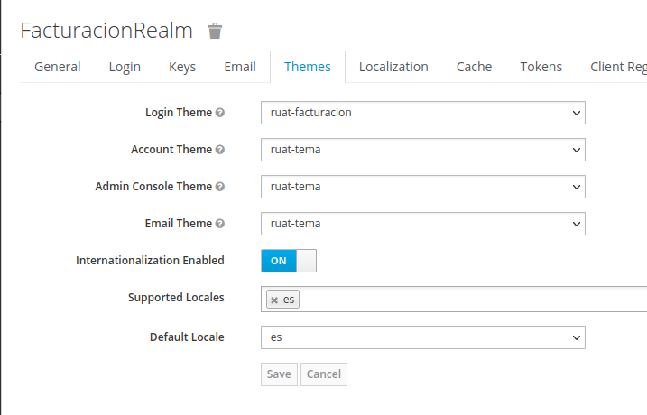
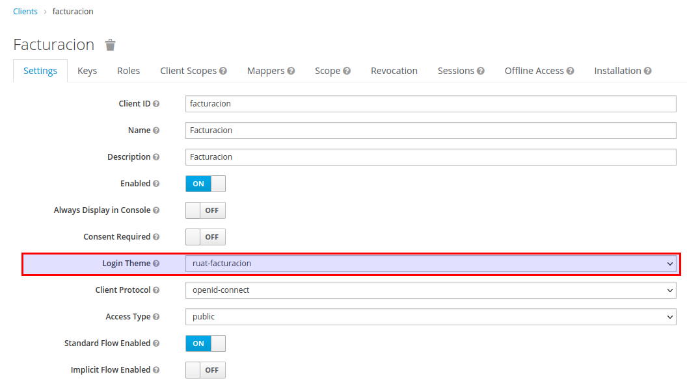

# Temas de Keycloak - RUAT

Proyecto que contiene temas base para las aplicaciones RUAT, basados en el tema `keycloak` que viene en los temas de KEYCLOAK.

## Version Keycloak

La version de keycloak 17.0.0

# Trabajar localmente

Se bajara una version de keycloak (17.0.0) y se instalara segun su sitio oficial en, Keycloak on OpenJDK:
https://www.keycloak.org/getting-started/getting-started-zip, una vez levantado se puede trabajar en su carpeta `themes`.

## Bajar el proyecto en tu folder de keycloak y editar las plantillas

Si se desea trabajar el tema en una carpeta local de keycloak ejecutar lo siguiente en la ruta `%KEYCLOAK_HOME%\themes`

    git init
    git remote add origin http://172.21.129.42:17080/desarrollo/keycloakadiciones/temas-keycloak.git
    git fetch
    git checkout <NOMBRE_RAMA>
    git pull

Levantar keycloak, ir al %KEYCLOAK_HOME% y ejecutar (Luego revisar la ruta http://localhost:8080)

    ./bin/kc.sh start-dev

## Uso de plantillas en una aplicacion

Para el ejemplo de la plantilla de `ruat-facturacion` tomar en cuenta la configuracion en la pestaña `themes` del `Realm` (La internacionalizacion en `es`)

Y en la configuracion en el cliente configurar el tema para el `Login`.

